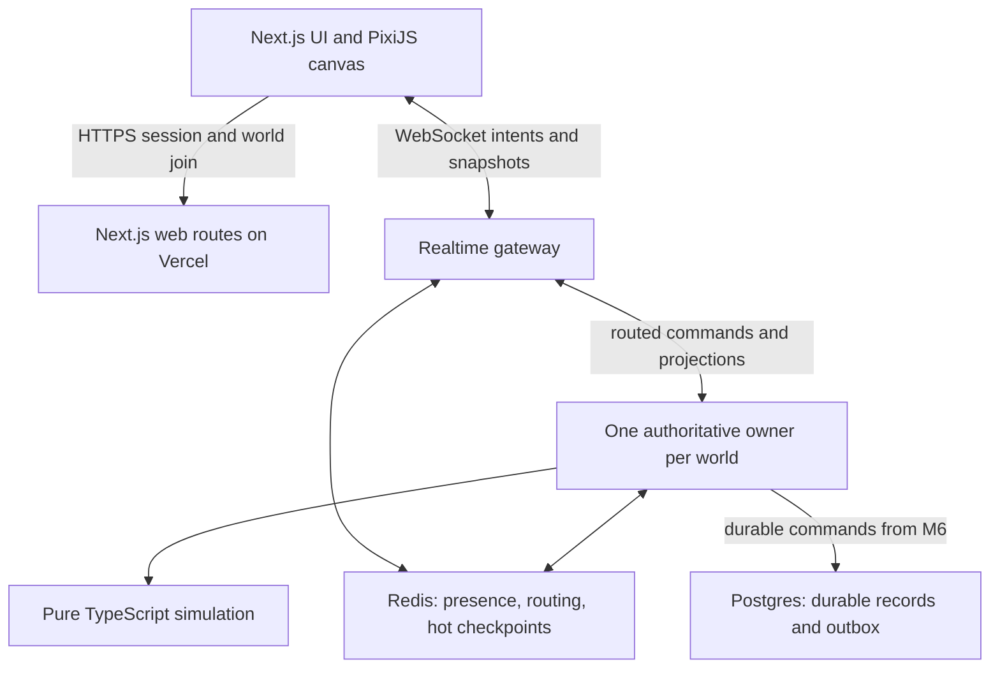

# Technical architecture

**Current M1 implementation:** [protocol 2 responsiveness contract](milestones/M1_RESPONSIVENESS.md). It supersedes the earlier 20 Hz prediction / per-tick Redis / 45-second rotation reference. Broader future-system proposals below remain outside M1.

## Decision summary

Build a TypeScript monorepo around a pure 2D simulation. Next.js hosts web UI on Vercel. PixiJS is the preferred client renderer. WebSockets carry player intents and authoritative snapshots. Redis coordinates hot room state; Postgres stores durable changes from M6 onward.

The hosting topology is provisional until the M1 deployment spike demonstrates room ownership, timer behavior, cross-instance routing and forced reconnects. Do not assume that accepting a WebSocket automatically solves authoritative simulation hosting.

Gateway and runner may share deployment code, but they have separate responsibilities. A connection instance is not automatically its world's owner. The Redis layer is not a second independent simulator.

## Module contracts

| Module | Responsibility | Must not depend on |
| --- | --- | --- |
| packages/simulation | Fixed-step movement, interactions, combat, creature state | React, PixiJS, network or DB clients |
| packages/world | Seeded generation, spatial queries, baseline collision | Rendering and HTTP |
| packages/protocol | Wire schemas, validation, version compatibility | Server secrets or concrete storage |
| packages/content | Versioned definition schemas and lookup | Mutable world state |
| apps/game-server | Sessions, owner lifecycle, simulation runner, adapters | Browser state as authority |
| apps/web | UI, transport client, prediction and rendering | Direct database/Redis access |

Start with folders where separate packages would add ceremony; preserve import direction. Shared code may calculate local predicted movement, but only the server commits it. Interfaces should emerge from one working case rather than a universal plugin engine.

## Proposed service boundaries

Session service authenticates a browser and authorizes world membership. Join returns a short-lived connection credential, world identity and protocol/content versions. Gateway validates it, routes sequenced commands to the owner and delivers only the player's authorized projection. Owner simulates loaded chunks, resolves rules and emits results. Storage adapter commits significant durable commands before acknowledging success from M6.

Minimal server-issued signed session credentials suffice for private prototype testing. Do not trust a character ID chosen by the browser. At M6 choose stable account/session recovery via an identity provider; provider selection remains open. Postgres ORM choice is also open; SQL constraints and transaction behavior matter more than an early library commitment.

## Deployment decision

Official Vercel documentation checked on 2026-09-06 describes WebSockets as beta, with connections pinned to one instance, reconnects potentially landing elsewhere, and connections ending at function maximum duration. It recommends external coordination. See [Vercel WebSockets](https://vercel.com/docs/functions/websockets).

Plan A: evaluate Vercel Fluid Compute for gateway and bounded room runner, renewing room ownership and checkpointing externally. M1 must prove the runner stays active while a room is occupied, rotates before runtime expiry, and cannot split into multiple authorities. No cron-driven combat tick or assumption of an immortal global variable.

Plan B if the measured runtime cannot satisfy the gate: keep Next.js/assets on Vercel and place the same runner/gateway on a long-lived regional Node service, retaining Redis/Postgres and transport contracts. Document the evidence and hosting decision before provisioning; a paid provider is not selected by this package.

Co-locate runner, Redis and Postgres in one region initially. Avoid multi-region writers or cross-world sharding in V1. Separate dev, preview and production namespaces/data. Cap active rooms and instrument resource use before a public launch.

## Server tick pipeline

At a fixed timestep: collect bounded validated commands → apply movement/collision → resolve interaction and combat intents → update creature brains → produce state/events → checkpoint and send per-client snapshots. Durable command staging in M6 may await I/O outside the pure step; prevent other commands from mutating reserved entities until commit/abort completes. Do not block the entire simulation on a database round trip every tick.

See [NETWORKING.md](NETWORKING.md) for owner failure and [PERSISTENCE.md](PERSISTENCE.md) for commit ordering. These contracts are mandatory before increasing concurrency.

## M0 implementation boundary (2026-09-06)

One root npm package is sufficient for this reference. `app/` is the future web module; `packages/world/index.ts` and `packages/simulation/index.ts` implement the pure module boundaries without separate package tooling. No game-server, transport, content framework or storage package exists yet.

The local browser harness owns the M0 position and calls pure `step(world, state, intent)` at 20 Hz. This is explicitly an offline sandbox exception, not the eventual multiplayer authority. M1 must run authoritative steps on a server and validate incoming intent. React and Pixi cannot introduce future authoritative mutations through this harness.

`World` is a finite read-only baseline of tile instances. Tile blocker kinds refer to two placeholder visual definitions in the rendering adapter; IDs include generation version, content version, seed and coordinates. Simulation accepts bounded directional input, normalizes diagonals and never reads browser state, wall time or unseeded randomness. The client harness handles time accumulation and pauses. There are no inbound network messages in M0.

The subsequent M0 style update adds only a local username label and browser fullscreen/menu UI. No identity service, persistence or protocol has been introduced. Procedural cosmetic terrain and atlas sprites belong to `app/art.ts`; `packages/world` and `packages/simulation` remain byte-identical to the original M0 baseline. See [style update evidence](milestones/M0_STYLE_UPDATE.md).

## M1 local implementation boundary (2026-09-06)

M1 has now been authorized and implemented locally. `apps/game-server/store.ts` owns Redis adapters and atomic Lua fencing; `server.ts` owns gateway admission, projections and a bounded candidate runner per occupied room; `main.ts` is the loopback Node launcher. Every gateway can contend for the same world, but only the Redis lease holder can commit or publish. Web and server use the unchanged pure movement/world modules. `packages/protocol/index.ts` supplies strict wire schemas; `app/network.ts` owns prediction and reconnects outside React. React still receives only low-frequency display status.

The browser's ordinary entry now requests a private server session. `?solo=1` retains the explicit M0 offline harness for engine tests. Shared-room clients cannot regenerate the seed. Gateway/runner processes use server-only Redis settings; only configured endpoint URLs enter the browser bundle. See [.env.example](../.env.example).

The current deployment artifact is a local Node service, not a proven Vercel function integration. Existing Vercel support for Node HTTP/ws servers makes that a candidate, but the max-duration/occupied-runner and overlapping-deployment tests have not run. Plan A versus Plan B remains undecided until the [M1 host gate](milestones/M1_LOCAL_RESULTS.md) has evidence. No production service has been provisioned.

## M1 hosted follow-up

The existing `teradas/astraworld` Vercel project now hosts Next.js session, health and WebSocket routes in `app/api/meadow/`, backed by `apps/game-server/vercel.ts` and the existing runner. The Vercel experimental upgrade API supplies ordinary ws sockets to the same admission/intent handler. The hosted lifecycle and rolling-deployment experiment passed; true TCP packet-loss validation remains before full M1 acceptance. No fallback host or new service was provisioned. [Deployment evidence](milestones/M1_DEPLOYMENT.md) supersedes the earlier local-only hosting status above.
